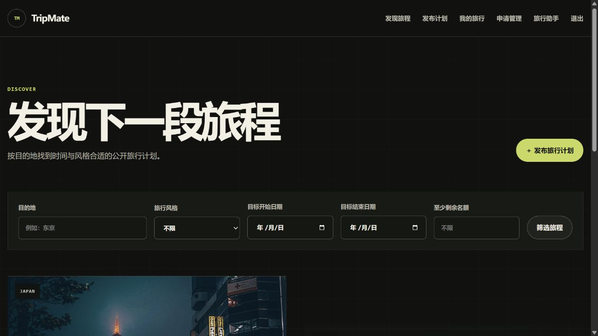
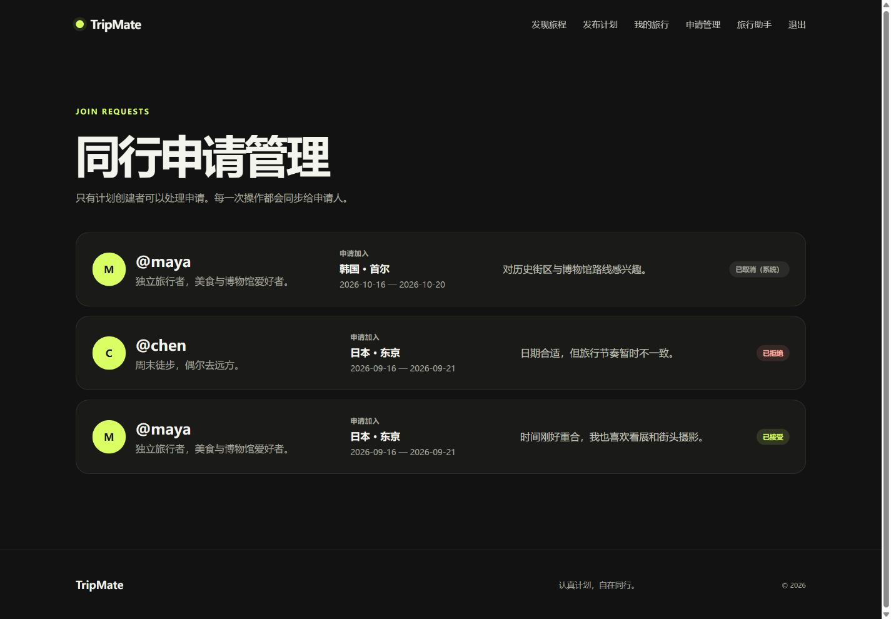
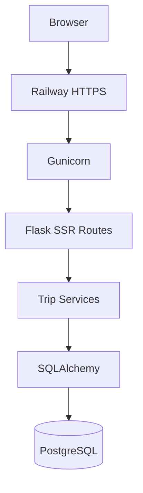
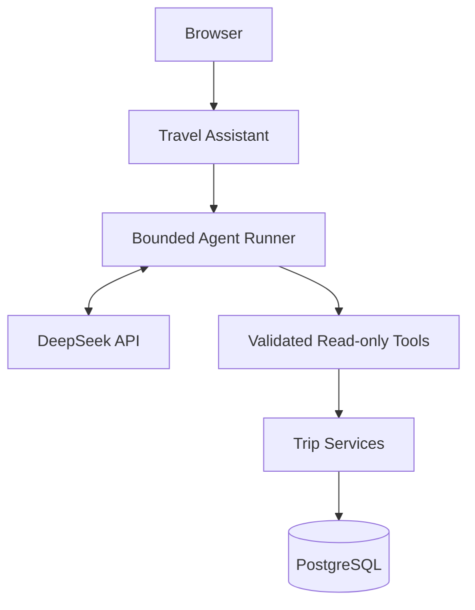

# TripMate

**A production-deployed travel companion matching platform with deterministic compatibility scoring and a read-only AI travel assistant.**

TripMate is a personal portfolio project built around complete travel and join-request lifecycles. It combines server-rendered Flask pages, explicit business services, relational persistence and a bounded DeepSeek Tool Calling assistant that reads the same trusted Service Layer as the Web application.

## Live Demo

- Application: <https://tripmate-production-a18c.up.railway.app>
- Health check: <https://tripmate-production-a18c.up.railway.app/health>

### Demo Account

> **DEMO ONLY**

- Email: `lin@example.test`
- Password: `Demo123!`

## Product Preview

### Travel discovery and advanced search



Users can combine destination, travel style, date overlap and minimum remaining-capacity filters. Results are ranked with explainable rule-based compatibility when search criteria are present.

### Join-request lifecycle



Creators review requests while Trip and JoinRequest state transitions preserve remaining capacity and cancel stale pending requests when a trip closes or fills.

### Read-only Travel Assistant


The assistant converts natural-language travel requirements into validated read-only Service calls. Markdown answers are rendered through an allowlist sanitizer before Jinja displays them.

## Core Features

- Account registration, login, logout and password hashing.
- Travel creation, editing, cancellation and public detail pages.
- Advanced travel search by destination, style, date overlap and remaining spots.
- Paginated discovery with stable deterministic ordering.
- Explainable compatibility score across destination, dates, style and capacity.
- JoinRequest lifecycle: `PENDING`, `ACCEPTED`, `REJECTED`, `CANCELLED`, `WITHDRAWN`.
- Trip lifecycle: `OPEN`, `CLOSED`, `CANCELLED`.
- Automatic closure at capacity and cancellation of remaining pending requests.
- Creator/applicant authorization, CSRF protection and SQLite foreign-key enforcement locally.
- Service Layer reused by Web routes and Agent tools.
- DeepSeek read-only Travel Assistant with safe Markdown presentation and accessible loading feedback.

## Backend Engineering Highlights

- **Business lifecycle integrity:** centralized transitions keep Trip capacity and JoinRequest states consistent after acceptance, withdrawal, manual closure or cancellation.
- **Service Layer:** travel search, public detail DTOs, public creator profiles and compatibility scoring are reusable outside Flask request context.
- **Database migrations:** Flask-Migrate/Alembic owns schema changes for both local SQLite and production PostgreSQL.
- **Production deployment:** Railway runs Alembic as a pre-deploy step and serves Flask through Gunicorn behind HTTPS.
- **Regression coverage:** tests cover authentication, CSRF, permissions, foreign keys, migrations, lifecycle rules, compatibility, Agent validation and presentation security.

## Read-only Agent

TripMate uses DeepSeek Tool Calling as a constrained query interface, not as an autonomous writer.

Available business capabilities include:

- `search_trips`
- `get_trip_details`
- `calculate_trip_compatibility`
- `get_creator_profile`

Safety boundaries:

- Only explicitly registered read-only tools can execute.
- Tool arguments use strict key, type, range, enum and ISO-date validation.
- The authenticated user identity comes from trusted Flask Session context.
- Public DTOs exclude email, password hashes and other private fields.
- Database and user-authored text returned by tools is treated as untrusted application data.
- The Agent cannot create, edit, cancel or apply to trips and cannot process requests.
- Provider Markdown is parsed and then sanitized with a minimal HTML allowlist; raw LLM HTML is never passed directly to Jinja.

## Production Architecture



Agent path:



The model does not calculate remaining spots, lifecycle state or compatibility scores. These values come from deterministic Python services and persisted application data.

## Technology Stack

- Python 3.13
- Flask 3.1, Jinja2 and vanilla JavaScript
- SQLAlchemy 2 and Flask-SQLAlchemy
- Flask-Migrate / Alembic
- PostgreSQL in production; SQLite for isolated local development and tests
- DeepSeek Chat Completions API with Tool Calling
- Markdown + Bleach for sanitized Agent presentation
- Gunicorn
- Railway
- pytest
- Git and GitHub

## Database Migration

Alembic manages the production schema. Application startup does not call `db.create_all()` to upgrade production databases.

```powershell
python -m flask --app run:app db current
python -m flask --app run:app db heads
python -m flask --app run:app db upgrade
```

The independent TripMate migration history creates a complete empty database and includes the current Trip and JoinRequest lifecycle constraints.

## Local Setup — Windows PowerShell

```powershell
git clone https://github.com/JianFeng1104/TripMate.git
cd TripMate

py -3.13 -m venv .venv
.\.venv\Scripts\Activate.ps1
python -m pip install -r requirements.txt

Copy-Item .env.example .env
python -m flask --app run:app db upgrade
python -m flask --app run:app seed-demo
python -m flask --app run:app run --debug --port 5000
```

Open <http://127.0.0.1:5000>. The ignored `.env` file is for local secrets only; hosting environments provide their own variables.

## Important Environment Variables

| Variable | Purpose |
|---|---|
| `TRIPMATE_ENV` | Selects development, testing, demo or production behavior |
| `TRIPMATE_SECRET_KEY` | Required production Session-signing secret |
| `DATABASE_URL` | Deployment database URI; Railway supplies a private PostgreSQL reference |
| `DEEPSEEK_API_KEY` | Enables Travel Assistant requests |
| `DEEPSEEK_BASE_URL` | DeepSeek API base URL |
| `DEEPSEEK_MODEL` | Configured DeepSeek model |
| `TRIPMATE_TRUST_PROXY` | Enables the expected single trusted proxy hop |

Never commit a populated `.env`, database credentials or API keys.

## Deployment

Railway deployment uses:

```text
Pre-deploy: python -m flask --app run:app db upgrade
Start:      gunicorn --bind 0.0.0.0:$PORT --workers 2 wsgi:app
Health:     GET /health
```

Production uses a private Railway PostgreSQL connection. PostgreSQL public access is not required.

## Testing

```powershell
python -m pytest -q
python -m pip check
```

Current local result: **128 passed**.

Automated tests use fake provider clients and do not call the real DeepSeek API. The online demo is separately verified against Railway PostgreSQL and the configured provider.

## Project Structure

```text
tripmate/
├─ agent/          # DeepSeek client, bounded runner and read-only tools
├─ services/       # Search, compatibility, public DTOs and trip operations
├─ templates/      # Jinja server-rendered pages
├─ static/         # CSS, vanilla JavaScript and local images
├─ presentation.py # Sanitized Agent Markdown rendering
├─ config.py       # Environment-specific configuration
├─ models.py       # User, Trip and JoinRequest models
└─ main.py         # Web routes and lifecycle workflows
migrations/        # Independent Alembic history
scripts/           # E-drive setup, launch and Agent smoke test
tests/             # Unit, integration, migration and security regression tests
docs/              # Architecture, deployment and screenshot documentation
railway.json       # Railway build/deploy configuration
wsgi.py            # Gunicorn WSGI entry point
```

## Limitations

- The Agent is intentionally stateless, non-streaming and read-only.
- Compatibility is deterministic rule scoring, not a learned recommendation model.
- Local development defaults to SQLite; the live deployment uses PostgreSQL.
- Distributed rate limiting and persistent Agent conversation history are outside this portfolio scope.
- Prompt Injection risk cannot be eliminated completely; the project uses explicit tools, validation, trusted context and untrusted-data labeling as defense in depth.
