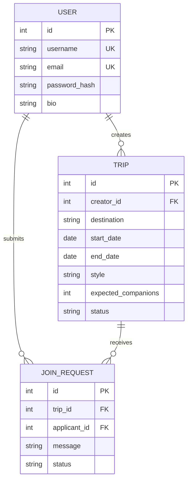

# TripMate MVP

TripMate 是一个面向独立旅行者的同行计划发布、发现与申请平台。本项目按 `Social_Product_PRD_MVP_v1.0.docx` 中的 **PRD 01** 实现，冻结在 P0 MVP 范围：

> 注册 / 登录 → 发布 Trip → 浏览与筛选 → 提交同行申请 → 创建者接受或拒绝 → 双方看到最终状态

项目采用适合计算机科学本科实习的轻量架构，重点展示关系数据库建模、Session 认证、状态流转、资源所有权、服务端校验、自动化测试和 Git 开发记录。

## 当前完成度

- 账号注册、登录、退出；密码使用 Werkzeug 安全哈希保存。
- 创建旅行计划；校验目的地、日期顺序、风格、简介和同行人数。
- 登录用户浏览公开计划、按目的地关键词筛选、查看详情。
- 非创建者提交一次同行申请；拦截自我申请和重复申请。
- 只有 Trip 创建者能接受、拒绝申请或关闭计划。
- 达到期望人数后自动关闭计划；已确认同行者显示在详情页。
- “我的旅行”同时展示我创建的计划和我发出的申请。
- CSRF 防护、HttpOnly / SameSite Session Cookie、1 MiB 请求上限和友好错误页。
- 演示数据命令与 14 项自动化测试。
- 响应式中文界面，可在桌面和移动宽度浏览。

## 技术栈

- Python 3.13
- Flask 3.1 + Jinja 服务端渲染
- Flask-SQLAlchemy 3.1 + SQLite
- HTML + CSS + 少量原生 JavaScript
- pytest 8.4
- Git

## 项目结构

```text
TripMate_MVP/
├─ run.py                     # 应用入口
├─ requirements.txt
├─ scripts/
│  ├─ setup_e_drive.ps1       # E 盘隔离安装
│  ├─ run_e_drive.ps1         # E 盘隔离启动
│  └─ test_e_drive.ps1        # E 盘隔离测试
├─ tripmate/
│  ├─ __init__.py             # App Factory 与配置
│  ├─ auth.py                 # 注册、登录、退出
│  ├─ main.py                 # Trip 与 JoinRequest 业务流程
│  ├─ models.py               # User / Trip / JoinRequest
│  ├─ commands.py             # 演示数据命令
│  ├─ utils.py                # CSRF、登录装饰器、URL 安全
│  ├─ templates/
│  └─ static/
├─ tests/                     # 自动化测试
├─ docs/
│  ├─ ACCEPTANCE_TESTS.md
│  └─ screenshots/
└─ instance/                  # 首次启动创建；SQLite 位于此处，不提交 Git
```

## 在 E 盘安装（不新增 C 盘项目占用）

项目必须保存在 E 盘。三个 PowerShell 脚本会将以下内容全部固定到项目目录：

- 虚拟环境：`.venv/`
- pip 缓存：`.cache/pip/`
- 临时文件：`.tmp/`
- Python 字节码：`.cache/pycache/`
- SQLite：`instance/tripmate.db`
- pytest 缓存：`.pytest_cache/`

当前机器已检测到 `D:\Python313\python.exe`，可以用它创建 E 盘虚拟环境。基础 Python 安装只负责运行，不会把项目依赖装入系统目录。

在 PowerShell 中进入项目目录后执行：

```powershell
Set-ExecutionPolicy -Scope Process Bypass
.\scripts\setup_e_drive.ps1
```

如果另一台机器的 Python 不在 `D:\Python313\python.exe`：

```powershell
.\scripts\setup_e_drive.ps1 -PythonExecutable "E:\Python313\python.exe"
```

脚本会拒绝在非 E 盘目录运行，以防误把虚拟环境或缓存写到其他盘。

## 启动

首次演示建议同时写入演示数据：

```powershell
.\scripts\run_e_drive.ps1 -SeedDemo
```

以后直接启动：

```powershell
.\scripts\run_e_drive.ps1
```

浏览器打开 <http://127.0.0.1:5000>。

演示账号：

| 用户名 | 邮箱 | 密码 | 角色示例 |
|---|---|---|---|
| `lin` | `lin@example.com` | `Demo123!` | Trip 创建者 |
| `maya` | `maya@example.com` | `Demo123!` | 创建者 / 申请者 |
| `chen` | `chen@example.com` | `Demo123!` | 申请者 |

`seed-demo` 是安全幂等的：数据库已有用户时会停止，不覆盖现有数据。

## 运行测试

```powershell
.\scripts\test_e_drive.ps1
```

当前基线：`14 passed`。测试覆盖：

- 注册、密码哈希、登录、退出与邮箱登录
- 重复注册与错误密码
- 登录保护、CSRF 和外部跳转拦截
- 双用户申请—接受闭环
- 自我申请、重复申请与越权处理
- 非法日期 / 过短内容
- 关闭计划后禁止申请
- 目的地筛选、拒绝状态与演示数据

手工验收步骤见 [docs/ACCEPTANCE_TESTS.md](docs/ACCEPTANCE_TESTS.md)。

## 数据模型



数据库层还包含日期、人数、状态和 `(trip_id, applicant_id)` 唯一约束，避免只依赖前端规则。

## 主要路由

| Method | Route | 用途 |
|---|---|---|
| GET / POST | `/auth/register` | 注册 |
| GET / POST | `/auth/login` | 登录 |
| POST | `/auth/logout` | 退出 |
| GET | `/trips` | Trip 列表与目的地筛选 |
| GET / POST | `/trips/new` | 创建 Trip |
| GET | `/trips/<id>` | Trip 详情 |
| POST | `/trips/<id>/apply` | 申请同行 |
| POST | `/trips/<id>/close` | 创建者关闭计划 |
| GET | `/requests` | 创建者查看申请 |
| POST | `/requests/<id>/accept` | 接受申请 |
| POST | `/requests/<id>/reject` | 拒绝申请 |
| GET | `/me/trips` | 我的 Trip 与申请 |

## 安全与隐私说明

- 所有状态变更使用 POST，并校验 CSRF Token。
- 密码仅保存哈希；应用不会回显密码。
- 服务端逐项校验输入，不能依赖修改前端绕过业务规则。
- 处理申请和关闭 Trip 时核对当前用户是否为创建者。
- Session Cookie 使用 HttpOnly 与 SameSite=Lax。
- 只收集完成闭环所需信息，不要求姓名、证件、住址或支付数据。
- 用于公开部署时必须设置随机 `TRIPMATE_SECRET_KEY`，并在 HTTPS 反向代理后启用 Secure Cookie。

## MVP 边界

本版本有意不做：实时聊天、地图、支付、AI 推荐、信用评分、行程预订、移动 App、Redis、Docker 和微服务。它们会显著扩大范围，却不影响“发布—申请—确认同行”这一核心闭环的实习验收。

## Git 提交节奏

提交记录按 PRD 的开发阶段组织：

1. `chore: scaffold Flask application`
2. `feat: implement TripMate core journey`
3. `docs: add E-drive workflow and delivery guide`

这能让评审者清楚看到骨架、核心功能、测试和交付完善的演进过程。
