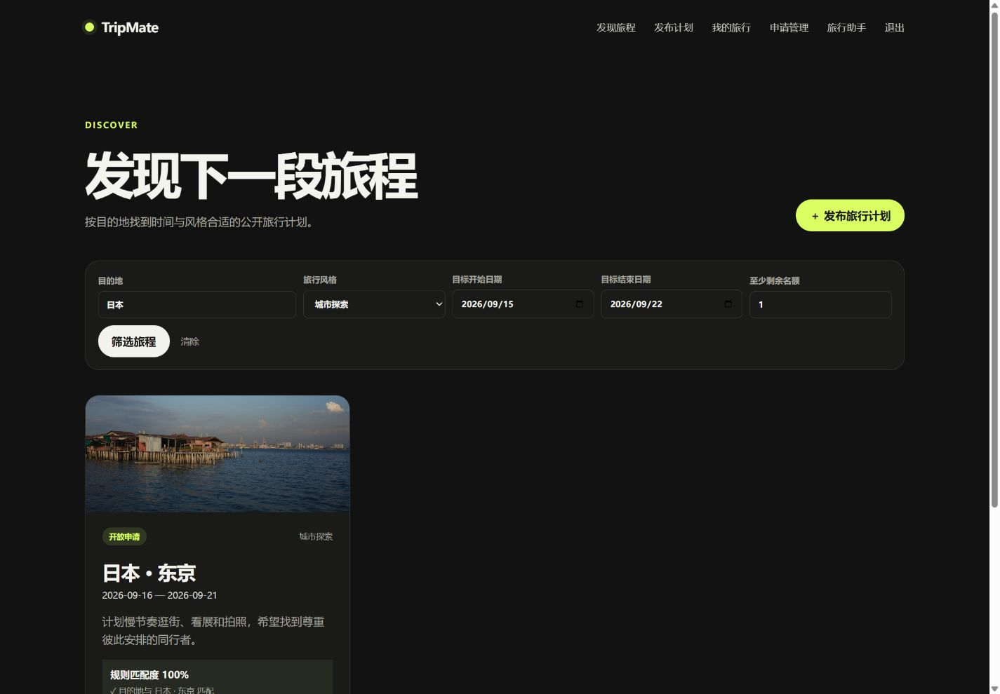
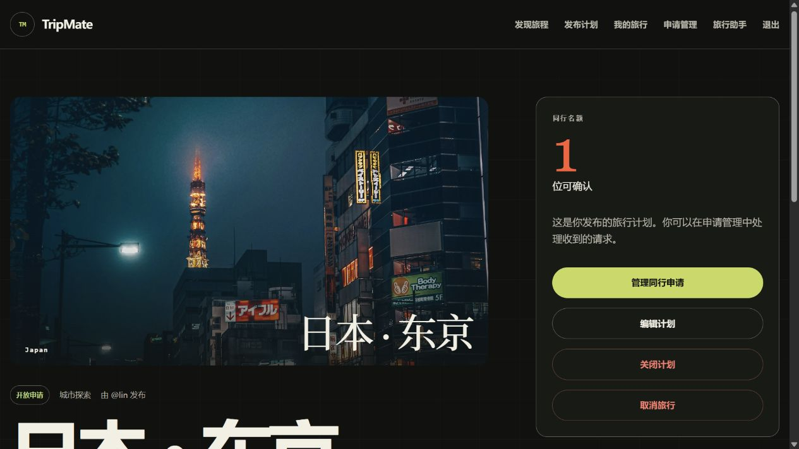
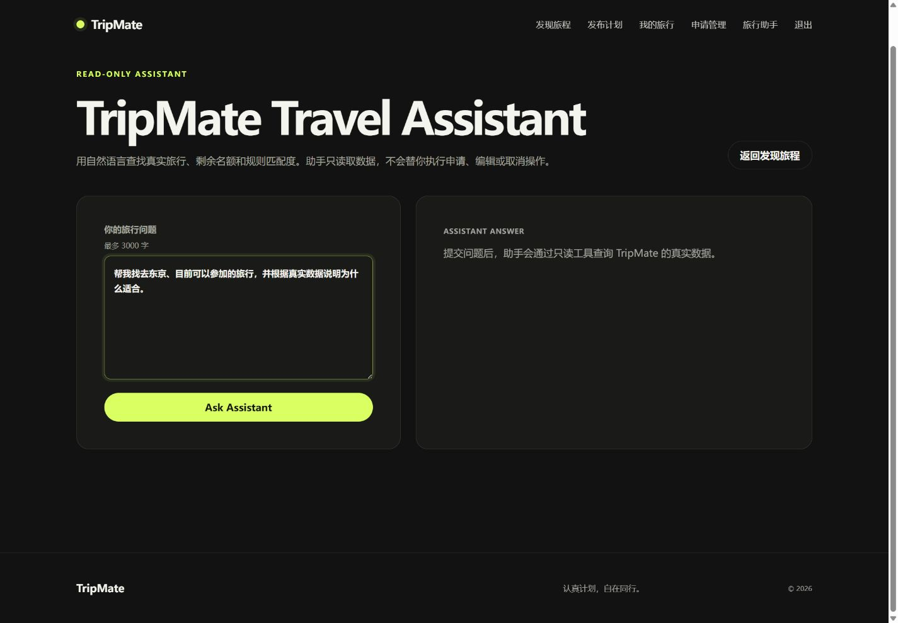
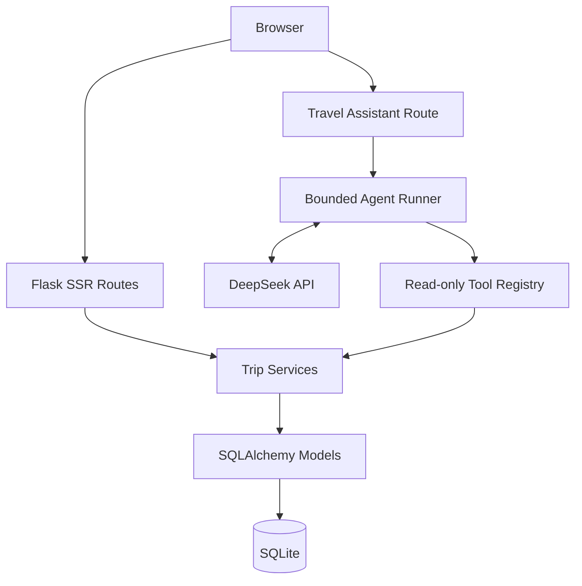

# TripMate

**A Flask travel-companion platform with capacity-aware Trip lifecycles, deterministic compatibility scoring, and a read-only DeepSeek travel assistant.**

## Overview

TripMate helps independent travelers publish upcoming trips, discover plans that fit their dates and travel style, and manage companion applications through a complete lifecycle. It is designed as a portfolio-scale MVP for users who want structured coordination before exchanging personal contact details.

The core product is conventional, testable application code: Flask SSR routes handle Web interaction, Services own search and compatibility rules, SQLAlchemy models enforce relational state, and Alembic manages Schema history. Trip capacity closes automatically when accepted applications fill the available places, while cancellation and withdrawal remain distinct business events.

The DeepSeek Travel Assistant adds natural-language discovery over this existing business layer. It can search real Trips, explain deterministic compatibility and read public creator data, but it cannot create, edit, cancel or apply for a Trip.

## Key Features

- Session-based registration, login and password hashing.
- Trip creation, editing, manual closing and cancellation.
- `OPEN → CLOSED / CANCELLED` Trip lifecycle with capacity management.
- `PENDING / ACCEPTED / REJECTED / CANCELLED / WITHDRAWN` JoinRequest lifecycle.
- Advanced search by destination, canonical travel style, date overlap and remaining capacity.
- Deterministic compatibility scoring with explainable destination, date, style and availability components.
- Creator-only request processing and resource-level authorization.
- DeepSeek V4 Flash Travel Assistant with real Tool Calling and no write tools.
- Independent Alembic migration history and SQLite foreign-key enforcement.
- Responsive Jinja UI, CSRF protection and project-specific Session cookie.

## Demo Preview

### Advanced Search and Compatibility



Filter real Trips by destination, style, dates and remaining capacity. Compatibility and reasons come from the deterministic Service layer.

### Trip Detail and Capacity



Trip details expose lifecycle status, creator information, confirmed companions and remaining capacity without exposing private account data.

### Read-only Travel Assistant



The Travel Assistant accepts natural-language questions and is restricted to read-only application tools; it cannot apply, edit or cancel on a user's behalf.

## Engineering Highlights

- Lifecycle rules keep Trip status, accepted capacity and outstanding requests consistent.
- Search, public DTO conversion and scoring are reused by both the Web UI and Agent tools.
- Compatibility is calculated at request time rather than stored as stale database state.
- Agent tools use an explicit allowlist, strict argument validation and bounded execution.
- Alembic owns Schema evolution; application startup never performs hidden `create_all()` upgrades.
- Production configuration fails closed when no valid Secret Key is provided.

## AI Agent Architecture

```text
Natural Language Request
        ↓
DeepSeek V4 Flash
        ↓
Tool Calling
        ↓
Read-only Tool Registry
        ↓
Existing Trip Services
        ↓
SQLAlchemy → SQLite
```

The LLM interprets language, selects tools and organizes returned data. It does **not** own capacity rules, Trip state, availability or compatibility weights. Compatibility Score is produced by the deterministic Python business engine, not generated by DeepSeek.

Tool-returned descriptions and profile text are treated as untrusted application data. This is defense-in-depth against indirect Prompt Injection; it is not presented as a complete solution to every model-security risk.

## Architecture



See [Architecture](docs/ARCHITECTURE.md) for layer responsibilities and invariants.

## Technology Stack

- Python 3.13
- Flask 3.1 and Jinja2
- Flask-SQLAlchemy / SQLAlchemy 2
- Flask-Migrate / Alembic
- SQLite
- HTML, CSS and vanilla JavaScript
- DeepSeek Chat Completions API with Tool Calling
- Gunicorn production WSGI server
- pytest

## Security

- Werkzeug password hashing; plaintext passwords are never stored.
- CSRF validation on state-changing forms.
- Authenticated Session with `HttpOnly`, `SameSite=Lax` and an independent `tripmate_session` cookie.
- Production enables `Secure` cookies and requires an environment-provided Secret Key.
- Resource ownership and server-side input validation.
- Public DTO and recursive private-field filtering before data reaches the LLM.
- Read-only Agent tool allowlist; no dynamic `eval`, `exec` or arbitrary function dispatch.
- Tool results are marked as untrusted data in the Agent instruction.
- API credentials are read from environment variables only.
- `nosniff` and conservative referrer-policy response headers.

Strict CSP and distributed Agent rate limiting remain future hardening work.

## Local Setup — Windows PowerShell

```powershell
git clone <your-repository-url>
cd 01_TripMate_MVP

py -3.13 -m venv .venv
.\.venv\Scripts\Activate.ps1
python -m pip install -r requirements.txt

# One-time local configuration. Edit .env and add your own values.
Copy-Item .env.example .env

python -m flask --app run:app db upgrade
python -m flask --app run:app seed-demo
python -m flask --app run:app run --debug --port 5000
```

Open <http://127.0.0.1:5000>. The existing E-drive workflow remains available:

```powershell
.\scripts\setup_e_drive.ps1
.\scripts\run_e_drive.ps1 -SeedDemo
```

`seed-demo` is idempotent for an empty demo database, refuses to overwrite existing users and is disabled in production.

## Environment Variables

For local development, copy [.env.example](.env.example) to the ignored `.env` file once and edit it locally. `.env` is local only and ignored by Git. Flask startup and the manual Agent smoke script load it automatically, so reopening PowerShell no longer requires setting the same variables again. Existing PowerShell/OS variables take precedence, and production continues to use hosting-platform variables. The application still starts without `.env`; no real secrets belong in Git.

| Variable | Required | Purpose |
|---|---:|---|
| `TRIPMATE_ENV` | Production | `development`, `testing` or `production` |
| `TRIPMATE_SECRET_KEY` or `SECRET_KEY` | Production | Flask Session signing secret |
| `TRIPMATE_DATABASE_URI` | No | Project-specific SQLAlchemy URI override |
| `DATABASE_URL` | No | Deployment-friendly database URI override |
| `DEEPSEEK_API_KEY` | Agent only | Enables the Travel Assistant |
| `DEEPSEEK_BASE_URL` | No | Defaults to `https://api.deepseek.com` |
| `DEEPSEEK_MODEL` | No | Defaults to `deepseek-v4-flash` |
| `TRIPMATE_TRUST_PROXY` | No | Trust exactly one proxy hop when explicitly set to true |
| `LOG_LEVEL` | No | Standard Python log level; defaults to `INFO` |

Without `DEEPSEEK_API_KEY`, registration, Trip workflows and search continue to work; only Agent submissions show a friendly configuration message.

## Database Migrations

```powershell
python -m flask --app run:app db current
python -m flask --app run:app db heads
python -m flask --app run:app db upgrade
```

Production releases must run `db upgrade` before starting new workers. Test fixtures may use `create_all()` only for isolated temporary databases.

## DeepSeek Agent

```powershell
# Put DEEPSEEK_API_KEY in the ignored .env file, then restart the app.
python -m flask --app run:app run --port 5000
```

After login, open `/travel-assistant`. The manual smoke test is intentionally outside pytest and spends API tokens only when explicitly run:

```powershell
python scripts\deepseek_agent_smoke.py
```

## Testing

```powershell
python -m pytest -q
```

Current result: **105 passed**. Tests block the real DeepSeek transport and use injected Fake Clients. Coverage includes authentication, CSRF, lifecycle permissions, capacity consistency, database constraints, migrations, search/scoring Services, Agent Tool Calling, Prompt Injection hardening and production-readiness behavior.

## Project Structure

```text
tripmate/
├─ agent/          # DeepSeek client, runner, instructions and read-only tools
├─ services/       # Search, deterministic compatibility and public DTOs
├─ templates/      # Jinja SSR pages and friendly error pages
├─ static/         # CSS, JavaScript and local imagery
├─ config.py       # Development/testing/production configuration
├─ models.py       # User, Trip and JoinRequest
└─ main.py         # Web routes and lifecycle actions
migrations/        # Independent Alembic history
scripts/           # E-drive workflow and manual Agent smoke test
tests/             # Unit, integration, migration and readiness tests
docs/              # Architecture, deployment and screenshot guidance
wsgi.py            # Production WSGI entry point
```

## Demo

Run `seed-demo` only in development. Demo accounts use password `Demo123!` and fake `example.test` email addresses:

| Username | Email | Portfolio scenario |
|---|---|---|
| `lin` | `lin@example.test` | Creator, accepted traveler and withdrawn applicant |
| `maya` | `maya@example.test` | Creator, accepted/rejected lifecycle participant |
| `chen` | `chen@example.test` | Creator with a full Trip and pending applicant |

The seed includes `OPEN`, `CLOSED` and `CANCELLED` Trips plus all JoinRequest states. Credentials are **DEMO ONLY** and are never created automatically in production.

- Screenshot plan: [docs/SCREENSHOTS.md](docs/SCREENSHOTS.md)
- Deployment-ready; live demo URL to be added.

## Production Start

Development uses Flask's server. A Linux production service uses Gunicorn:

```bash
python -m flask --app run:app db upgrade
gunicorn --bind 0.0.0.0:${PORT:-8000} --workers 2 wsgi:app
```

Health check: `GET /health` → `{"service":"TripMate","status":"ok"}`. See [Deployment Guide](docs/DEPLOYMENT.md) before publishing.

## Limitations

- SQLite is appropriate for the current MVP but requires persistent storage and has limited write concurrency.
- Ephemeral cloud filesystems can erase a SQLite database; managed PostgreSQL is recommended for a long-running public deployment.
- Trip ranking currently includes Python-side availability/scoring work that would need optimization at larger scale.
- The Agent has no persistent chat history, streaming output, write actions or per-user distributed rate limit.
- Prompt Injection risk can be reduced but not completely eliminated.
- No live public deployment URL is currently included.
