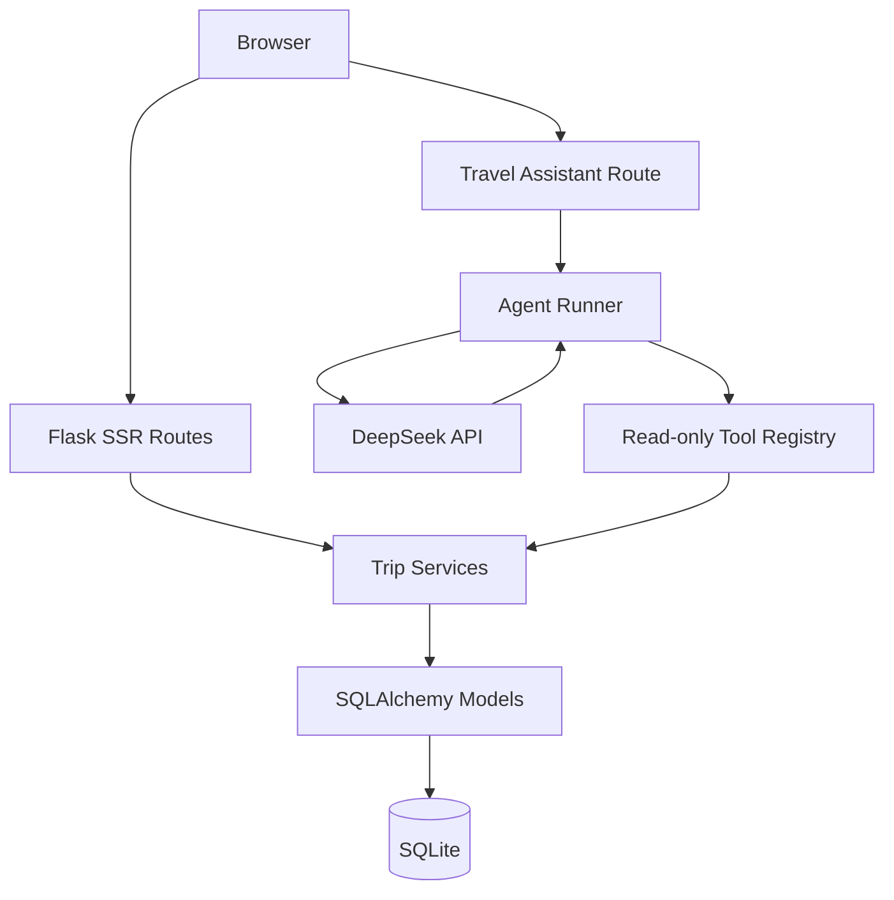

# TripMate Architecture

TripMate separates HTTP concerns, deterministic business rules, persistence, and the DeepSeek integration. The Agent never owns lifecycle rules, capacity calculations, search validation, or compatibility scoring.

## Layers

- **Web layer:** authentication, Session, CSRF, form validation, redirects, flash messages and Jinja rendering.
- **Service layer:** advanced Trip search, safe public DTOs and deterministic compatibility calculation.
- **Domain/persistence layer:** `User`, `Trip` and `JoinRequest`, including lifecycle, capacity and relational constraints.
- **Agent layer:** natural-language interpretation, bounded DeepSeek Tool Calling and an explicit read-only registry. Tool wrappers call Services and never query SQLAlchemy directly.
- **Migration layer:** Flask-Migrate/Alembic owns Schema creation and upgrades; production startup does not use `db.create_all()`.

## Important invariants

- Trip status is `OPEN`, `CLOSED` or `CANCELLED`.
- JoinRequest status is `PENDING`, `ACCEPTED`, `REJECTED`, `CANCELLED` or `WITHDRAWN`.
- Remaining capacity and compatibility scores come from deterministic Python code.
- Tool-returned user content is treated as untrusted data, not instructions.
